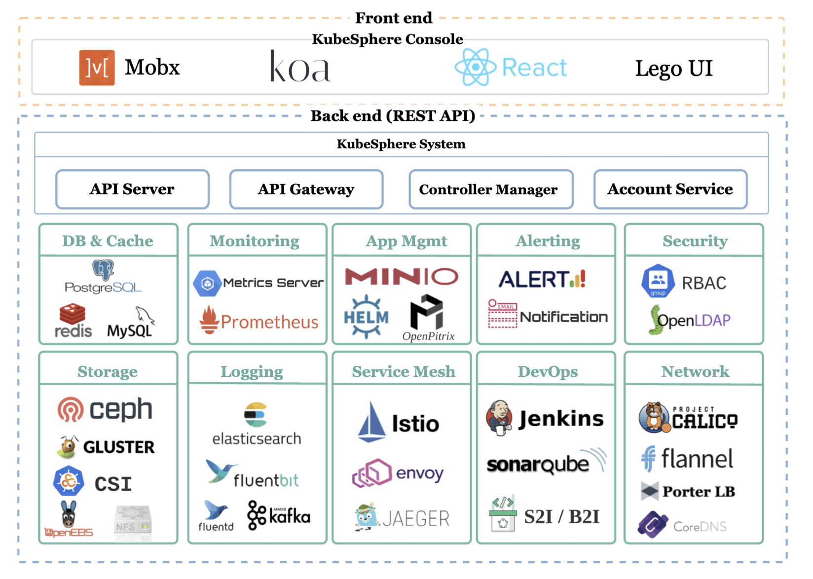

# KubeSphere 容器平台
[](https://github.com/KubeSphere/KubeSphere/blob/master/LICENSE)
[](https://travis-ci.org/kubesphere/kubesphere)
[](https://github.com/kubesphere/kubesphere/releases/tag/v2.1.1)


----

## KubeSphere 是什么

> [English](README.md) | 中文

[KubeSphere](https://kubesphere.com.cn) 是在 [Kubernetes](https://kubernetes.io) 之上构建的以**应用为中心的**多租户容器平台，提供全栈的 IT 自动化运维的能力，简化企业的 DevOps 工作流。KubeSphere 提供了运维友好的向导式操作界面，帮助企业快速构建一个强大和功能丰富的容器云平台，包括 Kubernetes 资源管理、DevOps (CI/CD)、应用生命周期管理、微服务治理 (Service Mesh)、多租户管理、监控日志、告警通知、存储与网络管理、GPU support** 等功能，未来还将提供多集群管理、Network Policy、镜像仓库管理等功能。KubeSphere 愿景是打造一个基于 Kubernetes 的云原生分布式操作系统，它的架构可以很方便地与云原生生态系统进行即插即用（plug-and-play）的集成。


> 说明：KubeSphere 目前最新的版本为 2.1.1，所有版本 100% 开源，关于 KubeSphere 更详细的介绍与说明请参阅 [什么是 KubeSphere](https://kubesphere.com.cn/docs/zh-CN/introduction/intro/)。


<table>
  <tr>
      <td width="50%" align="center"><b>KubeSphere Dashboard</b></td>
      <td width="50%" align="center"><b>Project Resources</b></td>
  </tr>
  <tr>
     <td></td>
     <td></td>
  </tr>
  <tr>
      <td width="50%" align="center"><b>CI/CD Pipeline</b></td>
      <td width="50%" align="center"><b>Application Store</b></td>
  </tr>
  <tr>
     <td></td>
     <td></td>
  </tr>
</table>

## 快速体验

使用体验账号 `demo1 / Demo123` 登录 [Demo 环境](https://demo.kubesphere.io/)，该账号仅授予了 viewer 权限，建议自行安装体验完整的管理功能。您还可以访问 Youtube 查看 [KubeSphere Demo 视频](https://youtu.be/u5lQvhi_Xlc)。

## 架构

KubeSphere 采用了前后端分离的架构设计，后端的各个功能组件可通过 REST API 对接外部系统，详见 [架构说明](https://kubesphere.com.cn/docs/zh-CN/introduction/architecture/)。本仓库仅包含后端代码，前端代码参考 [Console 项目](https://github.com/kubesphere/console)。



## 核心功能

|功能 |介绍 |
| --- | ---|
| Kubernetes 集群搭建与运维 | 支持在线 & 离线安装、升级与扩容 K8s 集群，支持安装 “云原生全家桶” |
| Kubernetes 资源可视化管理 | 可视化纳管原生 Kubernetes 资源，支持向导式创建与管理 K8s 资源 |
| 基于 Jenkins 的 DevOps 系统 | 支持图形化与脚本两种方式构建 CI/CD 流水线，内置 Source to Image（B2I）和 Binary to Image（B2I）等 CD 工具 |
| 应用商店与应用生命周期管理 | 提供应用商店，内置 Redis、MySQL 等九个常用应用，支持应用的生命周期管理 |
| 基于 Istio 的微服务治理 (Service Mesh) | 提供可视化无代码侵入的 **灰度发布、熔断、流量治理与流量拓扑、分布式 Tracing** |
| 多租户管理 | 提供基于角色的细粒度多租户统一认证，支持 **对接企业 LDAP/AD**，提供多层级的权限管理 |
| 丰富的可观察性功能 | 提供集群/工作负载/Pod/容器等多维度的监控，提供基于多租户的日志查询与日志收集，支持节点与应用层级的告警与通知 |
|基础设施管理|支持 Kubernetes 节点管理，支持节点扩容与集群升级，提供基于节点的多项监控指标与告警规则 |
| 存储管理 | 支持对接 Ceph、GlusterFS、NFS、Local PV，支持可视化管理 PVC、PV、StorageClass，提供 CSI 插件对接云平台存储 |
| 网络管理 | 支持 Calico、Flannel，提供 Porter LB 插件用于暴露物理环境 K8s 集群的 LoadBalancer 服务 |
| GPU support | 集群支持添加 GPU 与 vGPU，可运行 TensorFlow 等 ML 框架 |


> 以上功能说明详见 [产品功能](https://kubesphere.com.cn/docs/zh-CN/introduction/features/)。

----

## 最新发布

KubeSphere 2.1.1 已于 2020 年 02 月 23 日 正式发布，点击 [Release Notes For 2.1.1](https://kubesphere.com.cn/docs/zh-CN/release/release-v211/) 查看 2.1.1 版本的更新详情。

## 快速安装

### 部署在 Linux

- 操作系统
   - CentOS 7.5 (64 bit)
   - Ubuntu 16.04/18.04 LTS (64 bit)
   - Red Hat Enterprise Linux Server 7.4 (64 bit)
   - Debian Stretch 9.5 (64 bit)
- 配置规格（最低）
   - CPU：2 Core， 内存：4 G， 硬盘：100 G

#### All-in-One

执行以下命令下载 Installer，请关闭防火墙或 [开放指定的端口](https://kubesphere.com.cn/docs/v2.1/zh-CN/installation/port-firewall/)，建议使用干净的机器并使用 `root` 用户安装：

```bash
curl -L https://kubesphere.io/download/stable/latest > installer.tar.gz \
&& tar -zxf installer.tar.gz && cd kubesphere-all-v2.1.1/scripts

./install.sh
```

直接选择 `"1) All-in-one"` 即可开始快速安装。默认仅开启最小安装，请参考 [开启可插拔功能功能组件](https://kubesphere.com.cn/docs/zh-CN/installation/pluggable-components/) 按需开启其它功能组件。

> 注意：All-in-One 仅适用于**测试环境**，**正式环境** 安装和使用请参考 [安装说明](https://kubesphere.com.cn/docs/zh-CN/installation/intro/)。


### 部署在 Kubernetes

可参考 [前提条件](https://kubesphere.com.cn/docs/zh-CN/installation/prerequisites/) 验证是否满足以下条件：

> - `Kubernetes` 版本： `1.15.x、1.16.x、1.17.x`；
> - `Helm`版本： `2.10.0 ≤ Helm Version ＜ 3.0.0`（不支持 helm 2.16.0 [#6894](https://github.com/helm/helm/issues/6894)），且已安装了 Tiller，参考 [如何安装与配置 Helm](https://devopscube.com/install-configure-helm-kubernetes/) （预计 3.0 支持 Helm v3）；
> - 集群已有默认的存储类型（StorageClass），若还没有准备存储请参考 [安装 OpenEBS 创建 LocalPV 存储类型](../../appendix/install-openebs) 用作开发测试环境。


- 若您的集群可用的资源符合 CPU > 1 Core，可用内存 > 2 G，可参考以下命令开启 KubeSphere 最小化安装：

```yaml
kubectl apply -f https://raw.githubusercontent.com/kubesphere/ks-installer/master/kubesphere-minimal.yaml
```

请参考 [开启可插拔功能功能组件](https://kubesphere.com.cn/docs/v2.1/zh-CN/installation/pluggable-components/) 按需开启其它功能组件。

- 若您的集群可用的资源符合 CPU ≥ 8 Core，可用内存 ≥ 16 G，建议参考以下命令开启 KubeSphere 完整安装，即开启所有功能组件的安装：

```yaml
kubectl apply -f https://raw.githubusercontent.com/kubesphere/ks-installer/master/kubesphere-complete-setup.yaml
```

查看滚动刷新的安装日志，请耐心等待安装成功。当看到 `"Successful"` 的日志与登录信息提示，则说明 KubeSphere 安装成功，请使用日志提示的管理员账号登陆控制台。

```bash
kubectl logs -n kubesphere-system $(kubectl get pod -n kubesphere-system -l app=ks-install -o jsonpath='{.items[0].metadata.name}') -f
```

## 开始使用 KubeSphere

- [KubeSphere 文档中心 (En/中) ](https://kubesphere.io/docs/)
- [API 文档](https://kubesphere.com.cn/docs/v2.1/zh-CN/api-reference/api-docs/)

## 开发 KubeSphere

[开发指南](https://github.com/kubesphere/community/tree/master/developer-guide/development) 详细说明了如何从源码编译、KubeSphere 的 GitHub 工作流、如何贡献代码以及如何测试等。

## 路线图

目前，KubeSphere 已发布了 4 个大版本和 4 个小版本，所有版本都是完全开源的，参考 [Plans for 2.1.1 and 3.0.0](https://github.com/kubesphere/kubesphere/issues/1368) 了解后续版本的规划，欢迎在 GitHub issue 中提交需求。

**Express Edition** => **v1.0.x** => **v2.0.x**  => **v2.1.0** => **v2.1.1** => **v3.0.0**


## Landscapes

<p align="center">
<br/><br/>
&nbsp;&nbsp;&nbsp;&nbsp;
<br/><br/>
KubeSphere 是 CNCF 基金会成员并且通过了 <a href="https://www.cncf.io/certification/software-conformance/#logos">Kubernetes 一致性认证
</a>，进一步丰富了 <a href="https://landscape.cncf.io/landscape=observability-and-analysis&license=apache-license-2-0">CNCF 云原生的生态。
</a>
</p>

## Who Uses KubeSphere

[Powered by KubeSphere](docs/powered-by-kubesphere.md) 列出了哪些企业在使用 KubeSphere，如果您所在的企业已安装使用了 KubeSphere，欢迎提交 PR 至该页面。

## 技术社区

- [论坛](https://kubesphere.com.cn/forum/)
- [Slack Channel](https://join.slack.com/t/kubesphere/shared_invite/enQtNTE3MDIxNzUxNzQ0LTZkNTdkYWNiYTVkMTM5ZThhODY1MjAyZmVlYWEwZmQ3ODQ1NmM1MGVkNWEzZTRhNzk0MzM5MmY4NDc3ZWVhMjE)


## Bug 与建议反馈

欢迎在 [GitHub Issue](https://github.com/kubesphere/kubesphere/issues) 提交 Issue。
