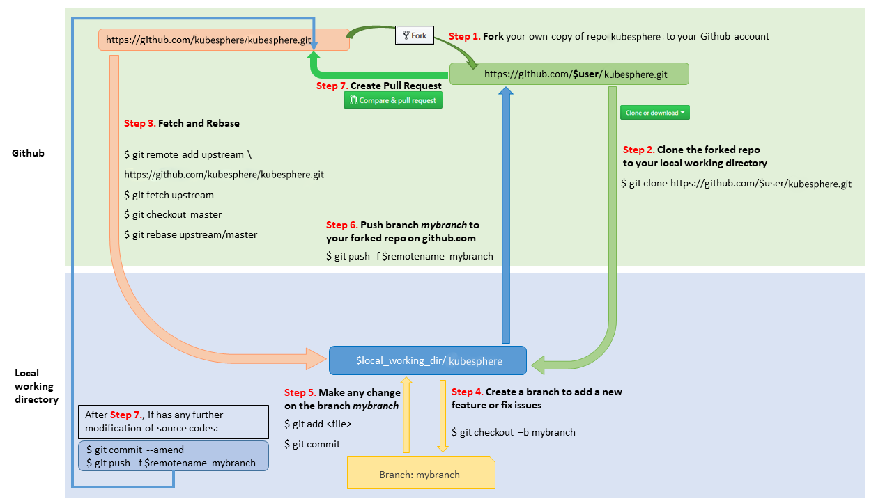

# Development Guide

This document walks you through how to get started developing KubeSphere and development workflow.

## Preparing the environment

### Go

KubeSphere development is based on [Kubernetes](https://github.com/kubernetes/kubernetes), both of them are written in [Go](http://golang.org/). If you don't have a Go development environment, please [set one up](http://golang.org/doc/code.html).

| Kubernetes     | requires Go |
|----------------|-------------|
| 1.13+          | >= 1.12     |

> Tips: 
> - Ensure your GOPATH and PATH have been configured in accordance with the Go
environment instructions. 
> - It's recommended to install [macOS GNU tools](https://www.topbug.net/blog/2013/04/14/install-and-use-gnu-command-line-tools-in-mac-os-x) for Mac OS.


### Dependency management

KubeSphere uses `dep` to manage dependencies in the `vendor/` tree, execute following command to install [dep](https://github.com/golang/dep).

```go
go get -u github.com/golang/dep/cmd/dep
```

### Test

In the development process, it is recommended to use local Kubernetes clusters, such as [minikube](https://kubernetes.io/docs/tasks/tools/install-minikube/), or to install an single-node [all-in-one](https://github.com/kubesphere/kubesphere#all-in-one) environment (Kubernetes-based) for quick testing.

> Tip: It also supports to use Docker for Desktop ships with Kubernetes as the test environment.

## Development Workflow



### 1 Fork in the cloud

1. Visit https://github.com/kubesphere/kubesphere
2. Click `Fork` button to establish a cloud-based fork.

### 2 Clone fork to local storage

Per Go's [workspace instructions][https://golang.org/doc/code.html#Workspaces], place KubeSphere' code on your `GOPATH` using the following cloning procedure.

1. Define a local working directory:

```bash
$ export working_dir=$GOPATH/src/kubesphere.io
$ export user={your github profile name}
```

2. Create your clone locally:

```bash
$ mkdir -p $working_dir
$ cd $working_dir
$ git clone https://github.com/$user/kubesphere.git
$ cd $working_dir/kubesphere
$ git remote add upstream https://github.com/kubesphere/kubesphere.git

# Never push to upstream master
$ git remote set-url --push upstream no_push

# Confirm that your remotes make sense:
$ git remote -v
```

### 3 Keep your branch in sync

```bash
git fetch upstream
git checkout master
git rebase upstream/master
```

### 4 Add new features or fix issues

Branch from it:

```bash
$ git checkout -b myfeature
```

Then edit code on the myfeature branch.

**Test and Build**

Currently, make rules only contain simple checks such as vet, unit test, will add e2e tests soon.

**Using KubeBuilder**

- For Linux OS, you can download and execute this [KubeBuilder script](https://raw.githubusercontent.com/kubesphere/kubesphere/master/hack/install_kubebuilder.sh).

- For MacOS, you can install KubeBuilder by following this [guide](https://book.kubebuilder.io/quick-start.html).

**Run and Test**

```bash
$ make all
# Run every unit test
$ make test
```

Run `make help` for additional information on these make targets.

### 5 Development in new branch

```bash
$ git add <file>
$ git commit -s -m "add your description"
```

### 6 Push to your folk

When ready to review (or just to establish an offsite backup or your work), push your branch to your fork on github.com:

```
$ git push -f ${your_remote_name} myfeature
```

### 7 Create a PR

- Visit your fork at https://github.com/$user/kubesphere
- Click the` Compare & Pull Request` button next to your myfeature branch.
- Check out the [pull request process](pull-request.md) for more details and advice.


